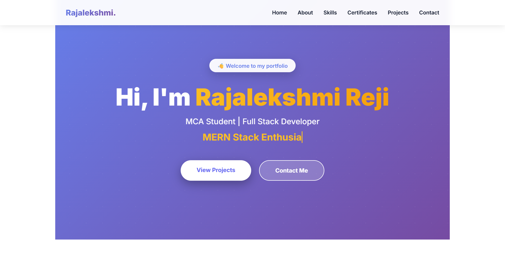
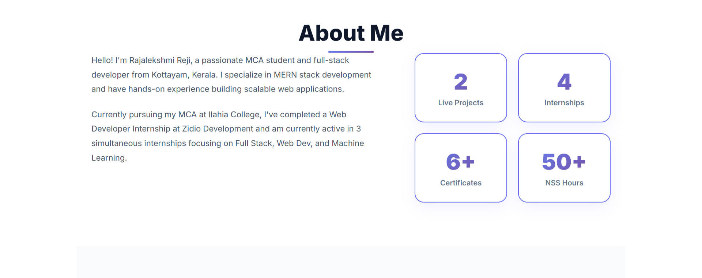
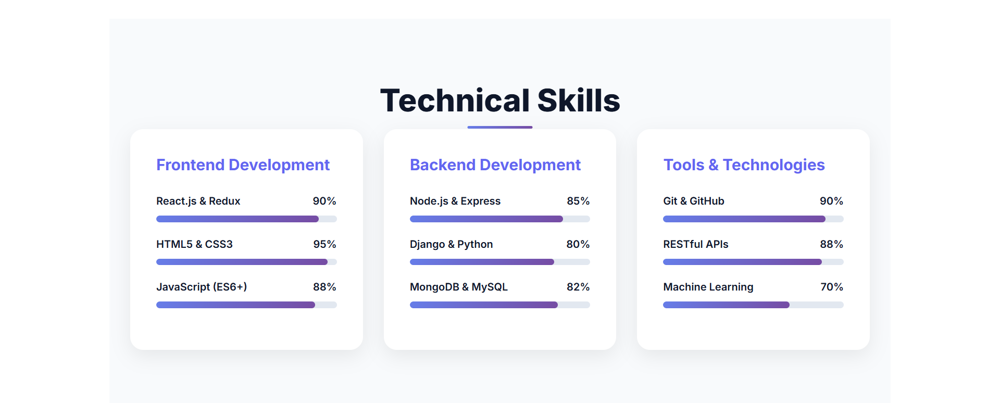
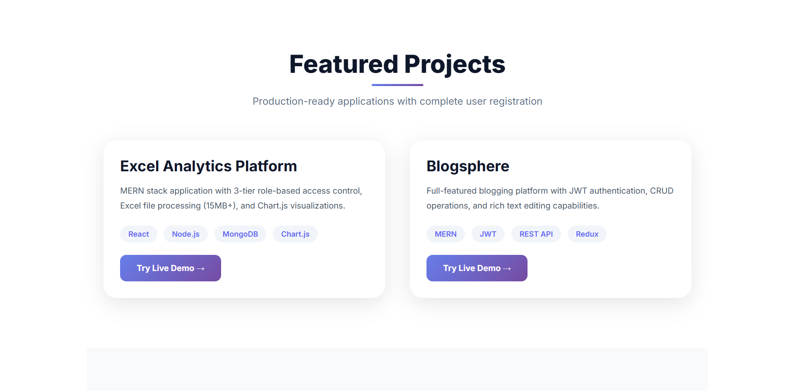
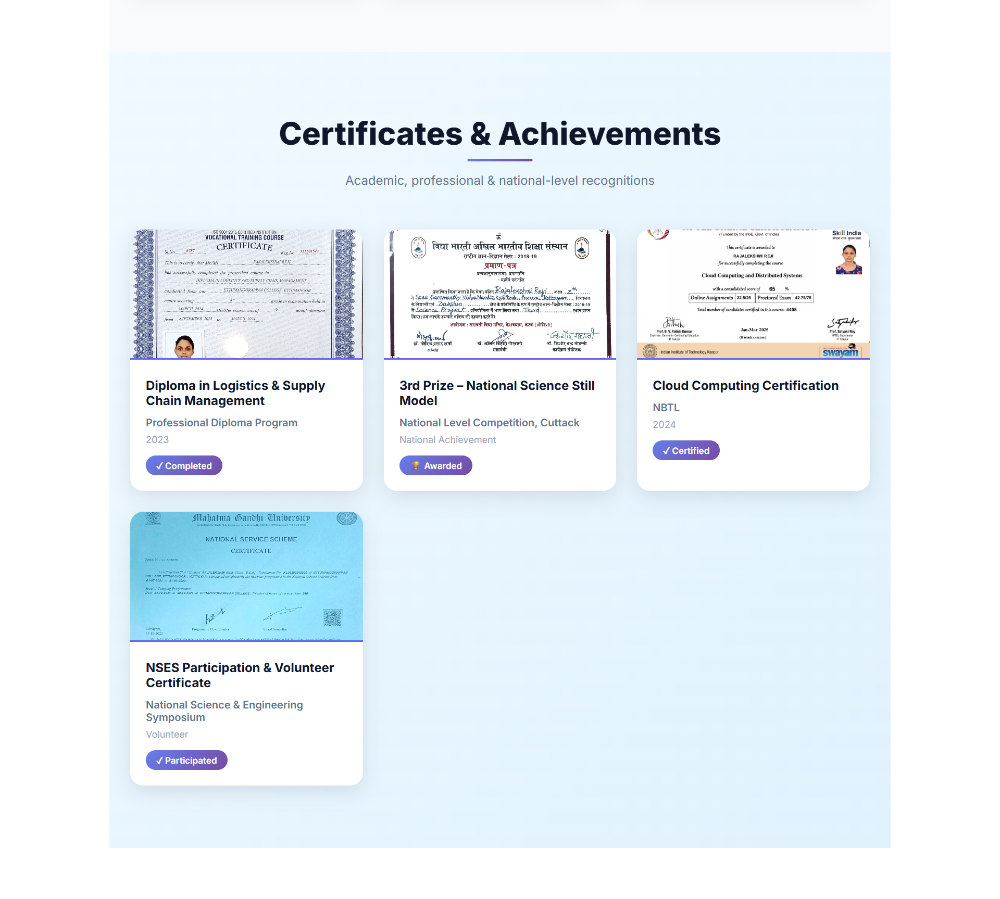
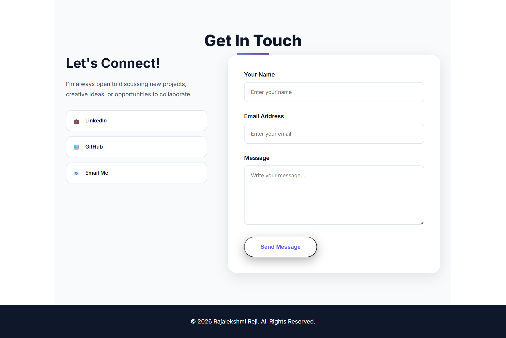

# Personal Portfolio Website


## 📌 Project Overview

A responsive personal portfolio website built as part of the **Coding Samurai Web Development Internship** (Level 1 - Project 1). This portfolio showcases my skills, projects, and provides a professional platform to connect with potential employers and collaborators.

**Developed by:** Rajalekshmi Reji  
**Internship:** Coding Samurai - Web Development  
**Project Level:** Beginner (Level 1)  
**Completion Date:** January 2026

## 🎯 Project Objectives

- Create a professional personal portfolio website
- Implement responsive design for all devices
- Use HTML5 semantic elements for better structure
- Style with modern CSS3 techniques
- Add interactivity using JavaScript
- Follow web development best practices
- Showcase technical skills and projects effectively

## 🛠️ Technologies Used

- **HTML5:** Semantic markup and structure
- **CSS3:** Modern styling, animations, flexbox, grid layouts
- **JavaScript:** DOM manipulation, form validation, interactive features

## ✨ Features

### 1. Navigation Bar
- Smooth scrolling to sections
- Sticky navigation on scroll
- Mobile-responsive hamburger menu
- Active section highlighting
- Clean and intuitive design

### 2. Hero/Home Section
- Professional introduction
- Eye-catching headline
- Call-to-action buttons
- Animated elements
- Profile image

### 3. About Me Section
- Personal introduction and background
- Educational details (Pursuing MCA)
- Professional summary
- Current role at Zidio Development
- Downloadable resume button
- Skills overview

### 4. Skills Section
- Technical skills showcase
- **Frontend:** HTML5, CSS3, JavaScript
- **Tools:** Git, GitHub, VS Code
- **Design:** Responsive Design, UI/UX principles
- Proficiency indicators
- Organized skill categories

### 5. Projects Section
- Project cards with hover effects
- Detailed project descriptions
- Technologies used for each project
- GitHub repository links
- Live demo links (where applicable)
- Visual project thumbnails

### 6. Certifications Section
- Professional certifications display
- Course completion certificates
- Achievement highlights
- Organized presentation

### 7. Contact Section
- Working contact form
- Email: rajalekshmireji2003@gmail.com
- Social media links (LinkedIn, GitHub)
- Location information (Kottayam, Kerala)
- Professional networking options

### 8. Footer
- Copyright information
- Quick navigation links
- Social media connections
- Professional branding

### 9. Additional Features
- Smooth scroll behavior throughout
- Fade-in animations on scroll
- Responsive images with lazy loading
- Cross-browser compatibility
- SEO optimized structure
- Accessibility features
- Fast loading performance

## 📸 Screenshots

### Home Section

*Hero section featuring professional introduction, animated elements, and call-to-action buttons*

### About Me Section

*Personal introduction showcasing educational background, current role at Zidio Development, and professional summary*

### Skills Section

*Comprehensive display of technical skills including Frontend technologies, tools, and design principles with proficiency indicators*

### Projects Section

*Project cards with hover effects, detailed descriptions, technology stacks, and links to GitHub repositories and live demos*

### Certifications Section

*Display of professional certifications and course completion achievements*

### Contact Section

*Working contact form with email, social media links, and professional networking options*

## 📂 Project Structure
```
Portfolio/
│
├── index.html          # Main HTML file with semantic structure
├── style.css           # Comprehensive stylesheet
├── script.js           # JavaScript for interactivity
├── README.md           # Project documentation (this file)
│
├── images/             # Certificate images
│   ├── blogsphere.png
│   ├── diploma-certificate.png
│   ├── excel-analytics.png
│   ├── nationalsciencecertificate.png
│   ├── nptel-certificate.png
│   └── nss-certificate.png
│
└── screenshots/        # Documentation screenshots
    ├── Home-Page.png
    ├── About.png
    ├── Skills.png
    ├── Projects.png
    ├── Certificates.png
    └── Contact.png
```

## 🚀 How to Run

### Option 1: Direct Method
1. Clone the repository or download the Portfolio folder
2. Navigate to the Portfolio directory
3. Open `index.html` in your web browser

### Option 2: Local Development Server (Recommended)

**Using Python:**
```bash
cd Portfolio
python -m http.server 8000
# Then open http://localhost:8000 in your browser
```

**Using Node.js:**
```bash
cd Portfolio
npx serve
```

**Using VS Code Live Server:**
1. Install "Live Server" extension in VS Code
2. Right-click `index.html`
3. Select "Open with Live Server"

## 📱 Responsive Design

The portfolio is fully responsive and optimized for:

### Breakpoints
- **Mobile:** 320px - 767px (Portrait & Landscape)
- **Tablet:** 768px - 1024px
- **Desktop:** 1025px - 1440px
- **Large Desktop:** > 1440px

### Mobile-First Approach
The design follows a mobile-first methodology, ensuring optimal performance on smaller devices and progressive enhancement for larger screens.

## 🎨 Design System

### Color Scheme
- Primary Color: #667eea (Purple-blue for headers and CTAs)
- Secondary Color: #764ba2 (Deep purple for accents)
- Background: #ffffff (Clean white)
- Text: #333333 (Dark gray for readability)
- Light Background: #f7f7f7 (Section alternation)
- Accent: #f093fb (Gradient highlights)

### Typography
- **Heading Font:** 'Poppins', sans-serif (Modern and professional)
- **Body Font:** 'Roboto', sans-serif (Highly readable)
- **Base Font Size:** 16px
- **Line Height:** 1.6 (Optimal readability)

### Spacing System
- Small: 0.5rem (8px)
- Medium: 1rem (16px)
- Large: 2rem (32px)
- Extra Large: 4rem (64px)

## 💡 Key Learnings

Through this project, I gained practical experience in:

- ✅ **HTML5 Semantic Structure:** Using semantic elements for better SEO and accessibility
- ✅ **CSS Flexbox & Grid:** Creating complex, responsive layouts efficiently
- ✅ **Responsive Design:** Implementing mobile-first design with media queries
- ✅ **JavaScript DOM Manipulation:** Making web pages interactive and dynamic
- ✅ **Form Validation:** Ensuring data integrity and user experience
- ✅ **Smooth Animations:** Enhancing user experience with CSS transitions
- ✅ **Cross-Browser Compatibility:** Testing and ensuring consistent experience
- ✅ **Version Control:** Using Git and GitHub for project management
- ✅ **Professional Documentation:** Writing clear and comprehensive READMEs

## 🔗 Links

- **Main Repository:** [CODING-SAMURAI-INTERNSHIP-TASK](https://github.com/RajalekshmiRe/CODING-SAMURAI-INTERNSHIP-TASK)
- **This Project:** [Portfolio Folder](https://github.com/RajalekshmiRe/CODING-SAMURAI-INTERNSHIP-TASK/tree/main/Portfolio)
- **LinkedIn Post:** [Video Demonstration](https://www.linkedin.com/posts/rajalekshmi-reji_codingsamurai-webdevelopment-internship-activity-7417635369757638656-TWcD?utm_source=share&utm_medium=member_desktop)

## 🎥 Video Demonstration

**Watch the complete project demonstration on LinkedIn:**

📹 [Project Showcase Video](https://www.linkedin.com/posts/rajalekshmi-reji_codingsamurai-webdevelopment-internship-activity-7417635369757638656-TWcD?utm_source=share&utm_medium=member_desktop)

**Video includes:**
- Complete portfolio walkthrough
- Responsive design demonstration (Desktop → Tablet → Mobile)
- Interactive features showcase
- Navigation and smooth scrolling
- Contact form demonstration
- Mobile menu functionality

**Posted with hashtags:** #CodingSamurai #WebDevelopment #Internship #FrontendDevelopment #HTML #CSS #JavaScript

## 🌐 Browser Compatibility

Tested and fully compatible with:

| Browser | Version | Status |
|---------|---------|--------|
| Chrome  | Latest  | ✅ Fully Supported |
| Firefox | Latest  | ✅ Fully Supported |
| Safari  | Latest  | ✅ Fully Supported |
| Edge    | Latest  | ✅ Fully Supported |
| Opera   | Latest  | ✅ Fully Supported |

## 🔧 Customization Guide

To customize this portfolio for your own use:

### 1. Personal Information
- Update name, bio, and profile picture in `index.html`
- Modify the About Me section with your story
- Change contact information (email, phone, location)

### 2. Projects
- Add your own projects in the Projects section
- Update project images and descriptions
- Modify technology tags to match your projects
- Add GitHub and live demo links

### 3. Skills
- Update skill levels based on your proficiency
- Add or remove skills as needed
- Modify skill categories (Frontend, Backend, Tools)

### 4. Colors and Branding
- Modify CSS variables in `style.css` for color scheme
- Update fonts to match your preference
- Adjust spacing and layout as needed

### 5. Contact Form
- Configure form endpoint for email functionality
- Update social media links
- Add additional contact methods if needed

## 📚 Resources Used

- **Documentation:**
  - [MDN Web Docs](https://developer.mozilla.org/) - HTML, CSS, JavaScript reference
  - [W3Schools](https://www.w3schools.com/) - Tutorials and examples
  - [CSS-Tricks](https://css-tricks.com/) - Advanced CSS techniques

- **Design Inspiration:**
  - Modern portfolio websites
  - UI/UX design principles
  - Color theory and typography

- **Tools:**
  - [Google Fonts](https://fonts.google.com/) - Typography
  - [Font Awesome](https://fontawesome.com/) - Icons
  - VS Code - Code editor
  - Git & GitHub - Version control

## 🐛 Known Issues

Currently, there are no known issues. The portfolio has been thoroughly tested across multiple devices and browsers.

If you encounter any issues, please feel free to reach out.

## 🔮 Future Enhancements

Potential improvements for future iterations:

- [ ] Dark mode toggle for better user preference
- [ ] Blog section integration for technical articles
- [ ] Project filtering system by technology
- [ ] Testimonials section from colleagues/clients
- [ ] Advanced animations with libraries (AOS, GSAP)
- [ ] Backend integration for contact form
- [ ] Google Analytics for visitor tracking
- [ ] Performance optimization (lazy loading, code splitting)
- [ ] Multilingual support
- [ ] Accessibility improvements (WCAG compliance)

## 📧 Contact

**Rajalekshmi Reji**

- **Email:** rajalekshmireji2003@gmail.com
- **LinkedIn:** [Rajalekshmi Reji](https://www.linkedin.com/in/rajalekshmi-reji)
- **GitHub:** [RajalekshmiRe](https://github.com/RajalekshmiRe)
- **Location:** Kottayam, Kerala
- **Current Role:** Zidio Development

For any questions, feedback, or collaboration opportunities regarding this project, feel free to reach out!

## 🙏 Acknowledgments

- **Coding Samurai** for providing this incredible internship opportunity and hands-on learning experience
- **Mentors and guides** who provided valuable feedback
- **Online tutorials and documentation** that aided in project completion
- **Web development community** for inspiration and best practices

## 📄 License

This project is part of the **Coding Samurai Internship Program**.

---

**Project Details:**
- **Created:** January 2026
- **Internship:** Coding Samurai Web Development
- **Level:** Beginner (Level 1)
- **Project Number:** #1 - Personal Portfolio Website

---

### 🏢 About Coding Samurai

Coding Samurai is a pioneering EdTech startup founded in August 2022, dedicated to bridging the gap between academic knowledge and industry expectations.

**Website:** [www.codingsamurai.in](https://www.codingsamurai.in)  
**LinkedIn:** [Coding Samurai](https://www.linkedin.com/company/coding-samurai)  
**Email:** support@codingsamurai.in

---

⭐ **If this portfolio helped or inspired you, please consider giving the repository a star!**

**#CodingSamurai #WebDevelopment #Portfolio #HTML #CSS #JavaScript #ResponsiveDesign**